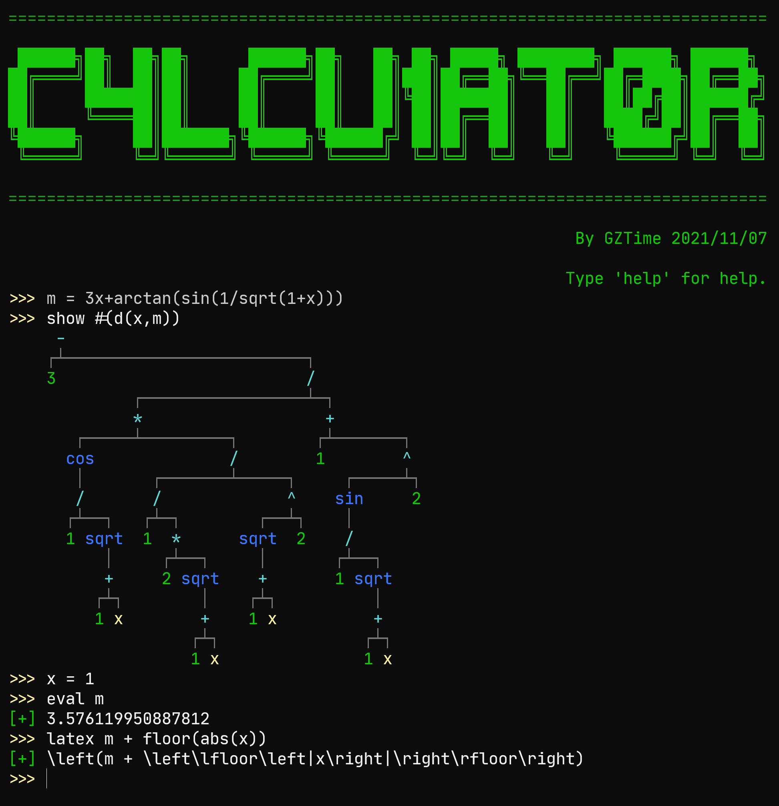

# ExprCalculator

This is another homework-expanded project.

More features:

- Show an expression as a tree.
- Show an expression in LaTeX format.
- Simplify an expression with simple rules.
- Calculate the value of an expression.
- Take the partial derivative of an expression with respect to a variable.

You can type `help` for more information and examples.

Compile the project with `dotnet publish -c Release -r win-x64`.

Use Windows Terminal for better experience.

